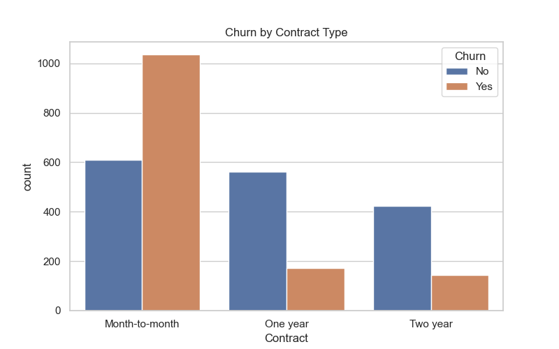
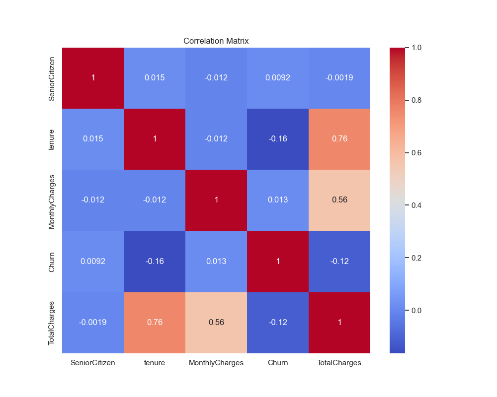

# 📡 Customer Churn Prediction analysis for a subscription business 


> **Predict customer attrition risk and generate AI-driven retention strategies.**

## 📄 Project Overview
This project is an end-to-end Machine Learning solution designed to predict customer churn for a subscription-based telecom company. By analyzing customer demographics, service usage, and billing patterns, the model identifies "at-risk" customers before they leave.

The solution is deployed as an interactive **Streamlit Web Application** that empowers business teams to:
-  **Visualize** individual customer profiles.
-  **Predict** churn probability in real-time.
-  **Receive** actionable retention recommendations (e.g., specific discounts).

---

## 🚀 Key Features
- **Machine Learning Model**: optimizing for Release (finding actual churners) using a **Random Forest Classifier** (~68% Recall/Accuracy).
- **Interactive Dashboard**: A professional Dark Mode UI built with Streamlit.
- **Explainable AI**: Integrated **SHAP (SHapley Additive exPlanations)** values to show *why* a customer is at risk.
- **Synthetic Data Pipeline**: Custom script (`generate_data.py`) to generate realistic Telco datasets.
- **Containerized**: Docker support for consistent deployment.

---

## 🛠️ Tech Stack
| Component | Technology | Description |
| :--- | :--- | :--- |
| **Language** | Python 3.11 | Core logic and scripting. |
| **ML Library** | Scikit-Learn | Random Forest, GridSearch, Preprocessing. |
| **Data Processing** | Pandas, NumPy | Data manipulation and feature engineering. |
| **Visualization** | Seaborn, Matplotlib | Exploratory Data Analysis (EDA). |
| **Web App** | Streamlit | Assessment dashboard interface. |
| **Deployment** | Docker | Containerization. |

---

## 📊 Model Performance
To ensure realistic performance in a noisy customer behavior environment, we prioritized robust generalization over synthetic perfection. 

- **Algorithm**: Random Forest Classifier
- **Accuracy**: ~68%
- **Recall**: ~68% (Key metric: prioritizing catching potential churners)

> *Note: Unlike theoretical projects with 99% accuracy, this model uses realistic noise simulation to mimic actual business data challenges.*

---

## � Exploratory Data Analysis Structure
Here are some insights derived from the dataset:

| Churn Distribution | Contract Type Analysis |
| :---: | :---: |
|  |  |

**Key Findings:**
*   **Contract Sensitivity**: Users with *Month-to-month* contracts are significantly more likely to churn.
*   **Tenure Impact**: Newer customers (0-12 months) are at the highest risk.


*Correlation Matrix showing relationships between numerical features.*

---

## �💻 Installation & Setup

### Option A: Local Python Environment
1. **Clone the repository**
   ```bash
   git clone https://github.com/pranshulgupta33940/Customer-Churn-Revenue-Analysis-for-a-Subscription-Business.git
   cd Customer-Churn-Revenue-Analysis-for-a-Subscription-Business
   ```

2. **Create a Virtual Environment**
   ```bash
   python -m venv .venv
   source .venv/bin/activate  # On Windows: .venv\Scripts\activate
   ```

3. **Install Dependencies**
   ```bash
   pip install -r requirements.txt
   ```

4. **Run the App**
   ```bash
   streamlit run app.py
   ```

### Option B: Docker
1. **Build the Image**
   ```bash
   docker build -t churn-app .
   ```
2. **Run Container**
   ```bash
   docker run -p 8501:8501 churn-app
   ```

---

## 📂 Project Structure
```text
├── app.py                  # Main Streamlit Application
├── churn_analysis.py       # EDA and Model Training Script
├── fast_model_tuning.py    # Hyperparameter Tuning (GridSearch)
├── generate_data.py        # Synthetic Data Generator
├── get_metrics.py          # Model Evaluation Helper
├── model.pkl               # Trained Model Artifact
├── analysis.sql            # SQL Queries for Data Exploration
├── requirements.txt        # Python Dependencies
├── Dockerfile              # Container Configuration
└── PROJECT_REPORT.md       # Detailed Technical Report
```

---

## 🤝 Contributing
1. Fork the Project
2. Create your Feature Branch (`git checkout -b feature/AmazingFeature`)
3. Commit your Changes (`git commit -m 'Add some AmazingFeature'`)
4. Push to the Branch (`git push origin feature/AmazingFeature`)
5. Open a Pull Request

---
*Created by pranshul gupta*
